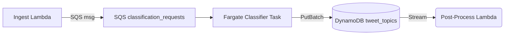

# Hierarchical Tweet Classification Service

> **Feature**: Two-Level categorization for GenAI–related tweets (Level-1 theme ➜ Level-2 sub-themes)  
> **Version**: 1.0 (Sequential LLM MVP)  
> **Status**: 🛠️ Planned

## Overview

This service assigns rich, hierarchical topics to every tweet processed by the GenAI Tweet Digest platform.  
Phase 1 implements a fast-to-ship MVP that leverages **two sequential LLM calls per tweet**—first to predict the top-level *theme* (Level-1) and then to choose fine-grained *sub-themes* (Level-2) restricted to that theme.

Key objectives:

1. **Accuracy** – Single best Level-1 label and zero-or-more Level-2 labels per tweet, with confidence scores.
2. **Scalability** – Real-time throughput ≥20 tweets/s and batch processing of ≥50 K tweets in <15 min.
3. **Evolvability** – Update taxonomy or swap models without breaking downstream contracts.
4. **Observability** – Metrics, logging, and versioning for audit & rollback.

## Architectural Fit

| Layer            | Responsibility                                   | Interaction |
|------------------|--------------------------------------------------|-------------|
| Ingest Lambda    | Fetch/clean tweets, enqueue SQS messages         | ➜ `classification_requests` queue |
| Classifier (Fargate) | Make sequential LLM calls, persist predictions | Pull **SQS** 🡒 LLM API 🡒 **DynamoDB** |
| Post-Process Lambda | React to DynamoDB stream for downstream tasks   | e.g. update search index, trigger email digest |

The classifier image is part of the **Fargate** tier (GPU-optional). Lambdas remain lightweight.

## Classification Flow (Per Tweet)

1. **Call-1 – Level-1 Theme**  
   Prompt lists **all Level-1 categories + descriptions** and instructs the model to choose *exactly one*.
2. **Call-2 – Level-2 Sub-Themes**  
   Prompt shows the chosen Level-1 description **plus** its Level-2 sub-categories. The model may return *zero or more* sub-themes (array) relevant to the tweet.
3. **Persist** results with confidences, prompt IDs, and `classifier_version`.

### Prompt Templates

**System (shared)**  
```
You are an expert taxonomy classifier for GenAI tweets.  
Return answers as valid JSON matching the requested schema. No extra keys, no commentary.
```

**User – Call-1**  
```
TWEET: "{{tweet_text}}"

Below is the complete set of Level-1 themes. Choose the single best theme.
Respond with: {"level1": "<Theme>", "confidence": <0-1 float>}

LEVEL-1 THEMES
1. Breakthrough Research — Novel scientific advances …
2. Model & Product Launches — Official releases …
… (12 items) …
```

**User – Call-2**  
```
TWEET: "{{tweet_text}}"
The tweet was classified as Level-1 = "{{level1}}".
Below are its Level-2 sub-themes. You may pick zero or more.
Respond with: {"level2": ["<Sub1>", …], "confidence": <0-1 float>}

SUB-THEMES FOR {{level1}}
1. Architecture Innovations — Brand-new network designs …
2. Training Methods — Fresh objectives …
… (≈6 items) …
```

Best-practice notes:
* Always wrap prompts in a **single system + single user** message pattern.
* Include 2-3 few-shot JSON examples for edge cases (e.g., ambiguous tweets) to improve consistency.
* Keep each prompt ≤3.5 K tokens to fit 4 K-context models.

## Data & Storage

DynamoDB table `tweet_topics`:

| Attribute       | Type    | Notes                                    |
|-----------------|---------|------------------------------------------|
| `tweet_id`      | PK (S)  | From upstream ingestion                  |
| `version`       | SK (S)  | e.g. `v1-seq-llm`                       |
| `level1`        | S       | Chosen theme                             |
| `level2`        | SS      | Set of sub-themes (may be empty)         |
| `conf_l1`       | N       | 0-1                                      |
| `conf_l2`       | N       | Average confidence of returned sub-themes|
| `processed_at`  | N (ISO) | Epoch milliseconds                       |

*GSI on `level1`* enables analytics; **TTL** can expire low-value rows.

## Processing Pipeline



Classifier task internals:
1. Batch-pop ≤32 messages
2. **async-gather** L1 LLM calls → collect results
3. **async-gather** corresponding L2 calls
4. Batch-write predictions; delete SQS messages

## Scaling & Performance

| Metric                    | Target                    |
|---------------------------|---------------------------|
| Cold-start time           | <15 s (model download amortised) |
| Throughput per task       | 10-15 tweets/s (600 concurrent LLM calls) |
| Batch job (50 K tweets)   | <15 min with 40 tasks     |
| Cost per tweet (GPT-3.5)  | ~$0.0008 (≈1.6 K tokens)  |

Tactics:
* Auto-scale on SQS depth + `InFlightRequests` CloudWatch metric.
* Connection pooling to reuse HTTPS/TLS sessions.
* Optional Redis/LRU cache keyed by tweet hash.

## Error Handling & Fallbacks

| Scenario                         | Action                                    |
|----------------------------------|-------------------------------------------|
| Invalid JSON                     | Regex fix → retry once                    |
| L1 confidence <0.3               | Store `Uncertain`, **skip** L2 call       |
| L2 label not in supplied list    | Record as `Other`                         |
| API 429 / 5xx                    | Exponential back-off (jitter), max 3 tries|
| Failed after retries             | Move SQS msg to DLQ                       |

## Cost Management

* Batch requests via **/v1/chat/completions** with `n` up to 20 where supported.
* Periodic label aggregation → fine-tune local model to cut inference spend in Phase 3.

## Roadmap & Future Migration

1. **Phase 0 – Design Freeze**: Approve taxonomy JSON + metrics.
2. **Phase 1 – Infrastructure**: SQS, DynamoDB, IAM, metrics dashboard.
3. **Phase 2 – Sequential LLM MVP (this doc)**: Ship to staging; gate by feature flag.
4. **Phase 3 – Data Labelling Tool**: Streamlit web UI to review & correct labels.
5. **Phase 4 – Fine-Tuned Transformer**: Two-stage local model (CPU/GPU) to replace LLM calls.
6. **Phase 5 – Backfill & Rollout**: Re-process historical tweets with new `classifier_version`.

## Next Steps

1. Final prompt wording & few-shot examples.
2. Estimate initial Fargate task count for expected volume.
3. Implement SQS consumer skeleton (`classifier_service`).
4. Create CloudWatch dashboards & alerts (latency, cost, error rate).

---
*Last updated: 2025-06-07* 