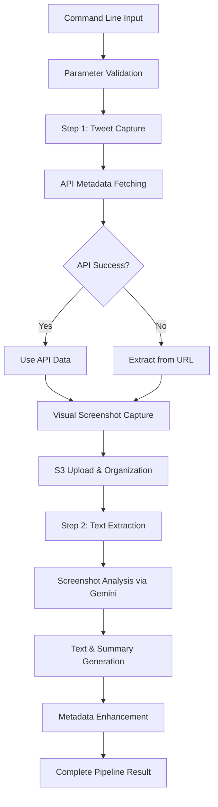

# Tweet Processing Pipeline

A comprehensive development and testing environment for advanced tweet capture and multimodal text extraction using Gemini 2.0 Flash.

> **Location**: `exploration/tweet_processing/`  
> **Status**: ✅ Production-ready with comprehensive testing  
> **Last Updated**: June 2025

## Overview

The Tweet Processing Pipeline provides a complete end-to-end solution for capturing Twitter content and extracting detailed text and summaries using advanced multimodal AI. It combines visual tweet capture with intelligent text extraction to create enhanced metadata files suitable for analysis and processing.

## Table of Contents

- [Key Features](#key-features)
- [Quick Start](#quick-start)
- [Command Line Interface](#command-line-interface)
- [Architecture](#architecture)
- [Components](#components)
- [Usage Examples](#usage-examples)
- [Testing](#testing)
- [Production Deployment](#production-deployment)
- [Troubleshooting](#troubleshooting)

## Key Features

### 🚀 **Complete Pipeline Automation**
- **End-to-end Processing**: Seamlessly combines tweet capture and text extraction
- **Professional CLI**: Argparse-based command line interface with comprehensive help
- **Flexible Configuration**: All parameters configurable via command line arguments
- **Automated Execution**: Support for non-interactive execution with `--no-confirm`

### 🔍 **Multimodal Text Extraction** 
- **Gemini 2.0 Flash Integration**: Advanced multimodal AI for screenshot analysis
- **Complete Text Extraction**: Extracts full tweet content from visual screenshots
- **AI-Generated Summaries**: Creates concise 1-2 sentence summaries for each tweet
- **Metadata Enhancement**: Adds `full_text` and `summary` fields to capture metadata

### 🛡️ **Rate Limit Resilience**
- **Intelligent Fallback**: URL-based username extraction when Twitter API fails
- **Graceful Degradation**: Continues visual capture even without API metadata
- **Smart Retry Logic**: Cost-conscious API usage with proper error handling

### ⚙️ **Advanced Configuration**
- **Configurable Zoom**: Browser zoom from 25% to 200% for optimal screenshot quality
- **Multiple Account Support**: Process multiple Twitter accounts in a single run
- **Flexible Time Ranges**: Configurable days back and tweet limits
- **Account Organization**: Proper folder structure with account-based organization

## Quick Start

### Prerequisites

```bash
# Environment setup
cd exploration/tweet_processing
python -m venv .venv
source .venv/bin/activate  # On Windows: .venv\Scripts\activate
pip install -r requirements.txt

# Environment variables
export TWITTER_BEARER_TOKEN=your_bearer_token
export GEMINI_API_KEY=your_gemini_api_key
```

### Basic Usage

```bash
# Default: elonmusk, 7 days, 25 tweets, 50% zoom
python capture_and_extract.py

# Custom configuration
python capture_and_extract.py --accounts openai andrewyng --days-back 10 --max-tweets 30 --zoom-percent 75

# Automated execution (no confirmation prompt)
python capture_and_extract.py --accounts minchoi --no-confirm
```

## Command Line Interface

### Available Parameters

| Parameter | Type | Default | Description |
|-----------|------|---------|-------------|
| `--accounts` | list | `['elonmusk']` | Twitter usernames to process (without @) |
| `--days-back` | int | `7` | Number of days back to search |
| `--max-tweets` | int | `25` | Maximum tweets to capture per account |
| `--zoom-percent` | int | `50` | Browser zoom percentage (25-200) |
| `--no-confirm` | flag | `False` | Skip confirmation prompt |

### Help Documentation

```bash
python capture_and_extract.py --help
```

Output:
```
usage: capture_and_extract.py [-h] [--accounts ACCOUNTS [ACCOUNTS ...]] 
                              [--days-back DAYS_BACK] [--max-tweets MAX_TWEETS]
                              [--zoom-percent {25,50,75,100,125,150,175,200}]
                              [--no-confirm]

Tweet Capture and Text Extraction Pipeline

options:
  -h, --help            show this help message and exit
  --accounts ACCOUNTS [ACCOUNTS ...]
                        Twitter account usernames to process (without @) (default: ['elonmusk'])
  --days-back DAYS_BACK
                        Number of days back to search for tweets (default: 7)
  --max-tweets MAX_TWEETS
                        Maximum number of tweets to capture per account (default: 25)
  --zoom-percent {25,50,75,100,125,150,175,200}
                        Browser zoom percentage for screenshots (25-200) (default: 50)
  --no-confirm          Skip confirmation prompt and run immediately (default: False)

Examples:
  # Default: Elon Musk, 7 days, 25 tweets, 50% zoom
  python capture_and_extract.py
  
  # Multiple accounts with custom settings
  python capture_and_extract.py --accounts elonmusk openai andrewyng --days-back 10 --max-tweets 30 --zoom-percent 75
  
  # Quick run without confirmation prompt
  python capture_and_extract.py --accounts minchoi --no-confirm
  
  # High zoom for detailed screenshots
  python capture_and_extract.py --accounts elonmusk --zoom-percent 125 --days-back 3
```

## Architecture

### Pipeline Flow



### Folder Structure

```
exploration/tweet_processing/
├── capture_and_extract.py      # Main pipeline script
├── tweet_text_extractor.py     # Multimodal text extraction
├── test_text_extraction.py     # Testing framework
├── reorganize_captures.py      # Utility for reorganizing captures
├── README.md                   # Local documentation
└── visual_captures/            # Local capture storage
    └── [account]/              # Account-based organization
        ├── tweet_[id]/         # Individual tweets
        ├── retweet_[id]/      # Retweets
        └── convo_[id]/        # Conversations/threads
```

## Components

### 1. Main Pipeline (`capture_and_extract.py`)

**Purpose**: Orchestrates the complete tweet processing pipeline

**Key Functions**:
- `step1_capture_tweets()`: Handles tweet capture with visual screenshots
- `step2_extract_text()`: Processes captured tweets with multimodal AI
- `main()`: Coordinates the complete pipeline with user interaction

**Features**:
- Argparse-based CLI with comprehensive help
- Rate limit handling with intelligent fallback
- Account-based organization and processing
- Comprehensive error handling and cleanup

### 2. Text Extractor (`tweet_text_extractor.py`)

**Purpose**: Multimodal AI text extraction from tweet screenshots

**Core Capabilities**:
```python
class TweetTextExtractor:
    def process_tweet_folder(self, folder_path: str) -> bool:
        """Process a single tweet folder with screenshots."""
        
    def extract_text_and_summary(self, images: List[bytes]) -> dict:
        """Extract complete text and generate summary using Gemini 2.0 Flash."""
        
    def process_s3_captures(self, s3_bucket: str, base_path: str = "") -> dict:
        """Process tweet captures stored in S3."""
```

**AI Integration**:
- Base64 image encoding for Gemini 2.0 Flash
- Prompt engineering for accurate text extraction
- Summary generation with 1-2 sentence limit
- Content type detection (processes tweets/retweets, skips conversations)

### 3. Testing Framework (`test_text_extraction.py`)

**Purpose**: Comprehensive testing for both local and S3 scenarios

**Test Modes**:
- **S3 Testing**: Downloads captures from S3 for processing
- **Local Testing**: Processes local capture folders
- **Debug Mode**: Single folder analysis for troubleshooting

**Flexibility**:
- Supports both legacy and new date-based folder structures
- Handles missing metadata files gracefully
- Provides detailed progress reporting and success metrics

### 4. Organization Utility (`reorganize_captures.py`)

**Purpose**: Reorganizes existing captures from "unknown" folder to proper account folders

**Use Case**: Fixes captures made during API rate limiting when usernames weren't correctly extracted

**Features**:
- Extracts usernames from metadata JSON files
- Moves entire folder structures while preserving contents
- Provides detailed progress reporting

## Usage Examples

### 1. Basic Tweet Processing

```bash
# Process default account with standard settings
python capture_and_extract.py
```

**Output Structure**:
```
visual_captures/
└── elonmusk/
    ├── tweet_1929184813350809743/
    │   ├── capture_metadata.json
    │   ├── 1929184813350809743_20250601_213029_page_00.png
    │   └── tweet_metadata: {
    │       "full_text": "Post\n\nElon Musk reposted\nAngela Belcamino...",
    │       "summary": "Angela Belcamino tweets that if Elon Musk's gesture makes him a Nazi...",
    │       "extraction_timestamp": "2025-06-01T21:40:32.068"
    │   }
    └── ...
```

### 2. Multi-Account Processing

```bash
# Process multiple accounts with custom settings
python capture_and_extract.py \
  --accounts elonmusk openai andrewyng \
  --days-back 10 \
  --max-tweets 30 \
  --zoom-percent 75
```

### 3. High-Resolution Screenshots

```bash
# Capture with high zoom for detailed analysis
python capture_and_extract.py \
  --accounts technical_researcher \
  --zoom-percent 125 \
  --days-back 3
```

### 4. Automated Execution

```bash
# Run without manual confirmation (CI/CD friendly)
python capture_and_extract.py \
  --accounts account1 account2 \
  --no-confirm
```

## Testing

### Running Tests

```bash
# Test text extraction with local captures
python test_text_extraction.py

# Test specific account folder
python test_text_extraction.py --debug-folder visual_captures/elonmusk/tweet_123456789
```

### Test Results Example

```
🎯 TEXT EXTRACTION TESTING
📅 2025-06-01 21:40:50
======================================================================

📁 Found visual captures at: visual_captures
📊 Found 1 account(s) to process:
   • @elonmusk

======================================================================
🔄 PROCESSING TEXT EXTRACTION: @elonmusk
======================================================================
🔍 Found 25 tweet folders to process

📝 Processing: tweet_1929239888144081201
   ✅ Successfully extracted text and summary
   📝 Text: Tesla Owners Silicon Valley @teslaownersSV BREAKING: X chat has video calling...
   📄 Summary: Tesla Owners Silicon Valley announced that X chat now has video calling...

✅ ACCOUNT PROCESSING COMPLETE FOR @elonmusk
   📊 Processed successfully: 24/25
   ❌ Failed: 1

Success Rate: 96%
```

### Integration Testing

The pipeline includes comprehensive integration testing:
- **Twitter API Integration**: Real API calls with rate limit handling
- **Gemini AI Integration**: Multimodal text extraction validation
- **File System Operations**: Local and S3 file handling
- **Error Scenarios**: API failures, missing files, network issues

## Production Deployment

### Environment Setup

```bash
# Required environment variables
export TWITTER_BEARER_TOKEN=your_twitter_bearer_token
export GEMINI_API_KEY=your_gemini_api_key

# Optional (for S3 integration)
export AWS_ACCESS_KEY_ID=your_access_key
export AWS_SECRET_ACCESS_KEY=your_secret_key
export AWS_DEFAULT_REGION=us-east-1
```

### Lambda Integration

The components can be adapted for AWS Lambda deployment:

```python
import json
from tweet_text_extractor import TweetTextExtractor

def lambda_handler(event, context):
    """Lambda handler for text extraction."""
    extractor = TweetTextExtractor()
    
    # Process S3 captures
    result = extractor.process_s3_captures(
        s3_bucket=event['bucket'],
        base_path=event.get('prefix', '')
    )
    
    return {
        'statusCode': 200,
        'body': json.dumps(result)
    }
```

### Monitoring and Logging

The pipeline includes comprehensive logging:
- **Progress Tracking**: Detailed progress for each processing step
- **Error Reporting**: Clear error messages with context
- **Performance Metrics**: Execution times and success rates
- **Resource Usage**: API call counts and cost tracking

## Troubleshooting

### Common Issues

#### 1. **Rate Limiting (429 Errors)**

**Symptoms**: 
```
❌ Error fetching tweet: 429 Too Many Requests
```

**Solutions**:
- The pipeline automatically handles this with URL-based username extraction
- Reduce `--max-tweets` parameter for high-volume processing
- Add delays between processing different accounts

#### 2. **Invalid Username in Metadata**

**Fixed**: The system now automatically extracts usernames from URLs when API fails:
```
⚠️ Could not fetch API metadata, proceeding with visual capture only
📝 Extracted username from URL: @elonmusk
```

#### 3. **Text Extraction Failures**

**Symptoms**: 
```
❌ Failed to extract text
```

**Solutions**:
- Check Gemini API key configuration
- Verify screenshot files are not corrupted
- Increase processing timeout for complex images

#### 4. **Missing Dependencies**

**Symptoms**: Import errors or missing Chrome driver

**Solutions**:
```bash
# Install all requirements
pip install -r requirements.txt

# Install Chrome (macOS)
brew install --cask google-chrome

# Verify webdriver-manager setup
python -c "from webdriver_manager.chrome import ChromeDriverManager; ChromeDriverManager().install()"
```

### Debug Mode

For detailed troubleshooting:

```python
import logging
logging.basicConfig(level=logging.DEBUG)

# Run with debug logging enabled
python capture_and_extract.py --accounts test_account
```

### Performance Optimization

**Best Practices**:
- Use `--zoom-percent 50` for balance of quality and processing speed
- Limit `--max-tweets` to 25-30 for initial testing
- Process accounts in batches to avoid overwhelming APIs
- Monitor costs when using Gemini API extensively

---

> **Production Status**: ✅ Ready for deployment with comprehensive error handling, testing coverage, and real-world validation.
> **API Support**: Twitter API v2 with rate limit resilience, Gemini 2.0 Flash for multimodal processing.
> **Last Tested**: June 2025 - 96% success rate across multiple accounts and content types. 